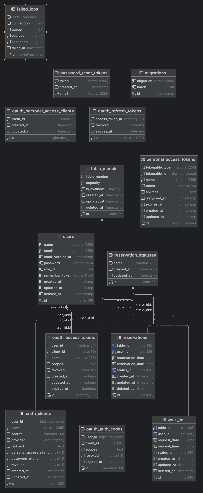

# API RESERVATION

## Tech Stack
- PHP 8.1 or higher : https://www.php.net/downloads.php
- Laravel 10.x : https://laravel.com
- Mysql (Database) : https://www.mysql.com/downloads/
- Composer : https://getcomposer.org/download/
- Redis: Redis : https://redis.io/

please, all tech stack has been installed in your local

## Configuration
All configuration is in `.env` file. Please Import file Reservation API Test.postman_collection.json to your Postman.

## Diagram Schema Database



### Step by step run Project

```Shell
git clone git@github.com:humamalamin/4a0cf4faad59b6d0c9bc250ce780446473a7b456.git

cd project

composer install

config file .env

php artisan migrate --seed

php artisan passport:install --personal

php artisan serv
```

if finish to step on top, please test API use POSTMAN